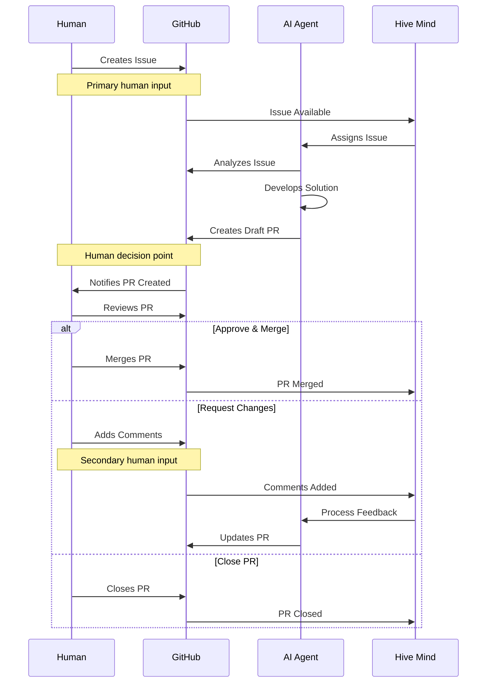
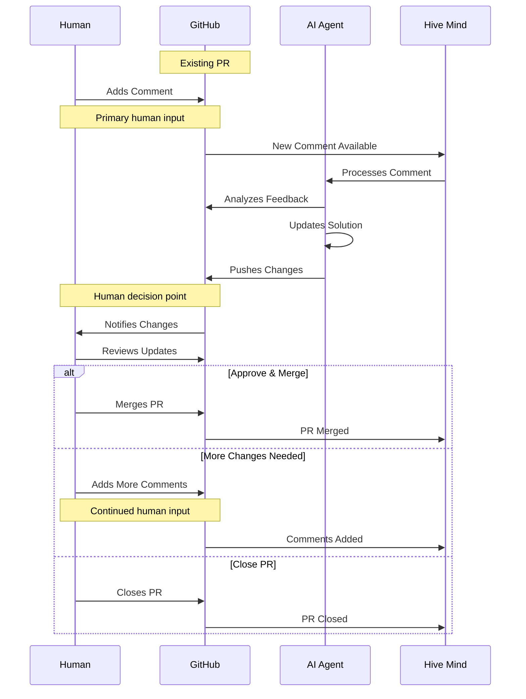

[](https://npmjs.com/@deep-assistant/hive-mind)
[](https://github.com/deep-assistant/hive-mind/blob/main/LICENSE)
[](https://github.com/deep-assistant/hive-mind/stargazers)

[](https://gitpod.io/#https://github.com/deep-assistant/hive-mind)
[](https://github.com/codespaces/new?hide_repo_select=true&ref=main&repo=deep-assistant/hive-mind)

# Hive Mind 🧠

**The master mind AI that controls hive of AI.** The orchestrator AI that controls AIs. The HIVE MIND. The SWARM MIND.

It is also possible to connect this AI to collective human intelligence, meaning this system can communicate with humans for requirements, expertise, feedback.

[](https://github.com/konard/problem-solving)

Inspired by [konard/problem-solving](https://github.com/konard/problem-solving)

## ⚠️ WARNING

It is UNSAFE to run this software on your developer machine.

It is recommended to use SEPARATE Ubuntu 24.04 installation (installation script is prepared for you).

This software uses full autonomous mode of Claude Code, that means it is free to execute any commands it sees fit.

That means it can lead to unexpected side effects.

There is also a known issue of space leakage. So you need to make sure you are able to reinstall your virtual machine to clear space and/or any damage to the virtual machine.

### ⚠️ CRITICAL: Token and Sensitive Data Security

**THIS SOFTWARE CANNOT GUARANTEE ANY SAFETY FOR YOUR TOKENS OR OTHER SENSITIVE DATA ON THE VIRTUAL MACHINE.**

There are infinite ways to extract tokens from a virtual machine connected to the internet. This includes but is not limited to:

- **Claude MAX tokens** - Required for AI operations
- **GitHub tokens** - Required for repository access
- **API keys and credentials** - Any sensitive data on the system

**IMPORTANT SECURITY CONSIDERATIONS:**

- Running on a developer machine is **ABSOLUTELY UNSAFE**
- Running on a virtual machine is **LESS UNSAFE** but still has risks
- Even though your developer machine data isn't directly exposed, the VM still contains sensitive tokens
- Any token stored on an internet-connected system can potentially be compromised

**USE THIS SOFTWARE ENTIRELY AT YOUR OWN RISK AND RESPONSIBILITY.**

We strongly recommend:
- Using dedicated, isolated virtual machines
- Rotating tokens regularly
- Monitoring token usage for suspicious activity
- Never using production tokens or credentials
- Being prepared to revoke and replace all tokens used with this system

Minimum system requirements to run `hive.mjs`:
```
1 CPU Core
1 GB RAM
> 2 GB SWAP
50 GB disk space
```

## 🚀 Quick Start

### Global Installation

#### Using Bun (Recommended)
```bash
bun install -g @deep-assistant/hive-mind
```

#### Using Node.js
```bash
npm install -g @deep-assistant/hive-mind
```

### Installation on Ubuntu 24.04 server

1. Reset/install VPS/VDS server with fresh Ubuntu 24.04
2. Login to `root` user.
3. Execute main installation script
   ```bash
   curl -fsSL -o- https://github.com/deep-assistant/hive-mind/raw/refs/heads/main/scripts/ubuntu-24-server-install.sh | bash
   ```
   Note: in the process of installation you will be asked to authorize using GitHub account, it is required for gh tool to be working, the system will do all actions using that GitHub account.

4. Login to `hive` user
   ```bash
   su - hive
   ```

5. Claude Code CLI and OpenCode AI CLI are preinstalled with the previous script, now you need to make sure claude is authorized also. Execute claude command, and follow all steps to authorize the local claude
   ```bash
   claude
   ```

   Note: opencode at the moment comes with free Grok Code Fast 1 model by default - so no authorization here is required.

6. Launch the Hive Mind telegram bot:

   **Using Links Notation (recommended):**
   ```
   screen -S bot # Enter new screen for bot

   hive-telegram-bot --configuration "
     TELEGRAM_BOT_TOKEN: '849...355:AAG...rgk_YZk...aPU'
     TELEGRAM_ALLOWED_CHATS:
       -1002975819706
       -1002861722681
     TELEGRAM_HIVE_OVERRIDES:
       --all-issues
       --once
       --auto-fork
       --skip-issues-with-prs
       --attach-logs
       --verbose
       --no-tool-check
     TELEGRAM_SOLVE_OVERRIDES:
       --auto-fork
       --auto-continue
       --attach-logs
       --verbose
       --no-tool-check
     TELEGRAM_BOT_VERBOSE: true
   "

   # Press CTRL + A + D for detach from screen
   ```

   **Using individual command-line options:**
   ```
   screen -S bot # Enter new screen for bot

   hive-telegram-bot --token 849...355:AAG...rgk_YZk...aPU --allowed-chats "(
     -1002975819706
     -1002861722681
   )" --hive-overrides "(
     --all-issues
     --once
     --auto-fork
     --skip-issues-with-prs
     --attach-logs
     --verbose
     --no-tool-check
   )" --solve-overrides "(
     --auto-fork
     --auto-continue
     --attach-logs
     --verbose
     --no-tool-check
   )" --verbose

   # Press CTRL + A + D for detach from screen
   ```

   Note: You may need to register you own bot with https://t.me/BotFather to get the bot token.


#### Codex sign-in

1. Connect to your instance of VPS with Hive Mind installed, using SSH with tunnel opened
```bash
ssh -L 1455:localhost:1455 root@123.123.123.123
```

2. Start codex login oAuth server:

```bash
codex login
```
The oAuth callback server on 1455 port will be started, and the link to oAuth will be printed, copy the link.

3. Use your browser on machine where you started the tunnel from, paste there the link from `codex login` command, and go there using your browser. Once redirected to localhost:1455 you will see successful login page, and in `codex login` you will see `Successfully logged in`. After that `codex login` command will complete, and you can use `codex` command as usual to verify. It should also be working with `--tool codex` in `solve` and `hive` commands.

### Core Operations
```bash
# Solve using maximum power
solve https://github.com/Veronika89-lang/index.html/issues/1 --auto-continue --attach-logs --verbose --model opus --auto-fork --think max

# Solve GitHub issues automatically (auto-fork if no write access)
solve https://github.com/owner/repo/issues/123 --auto-fork --model sonnet

# Solve issue with PR to custom branch (manual fork mode)
solve https://github.com/owner/repo/issues/123 --base-branch develop --fork

# Continue working on existing PR
solve https://github.com/owner/repo/pull/456 --model opus

# Resume from Claude session when limit is reached
solve https://github.com/owner/repo/issues/123 --resume session-id

# Start hive orchestration (monitor and solve issues automatically)
hive https://github.com/owner/repo --monitor-tag "help wanted" --concurrency 3

# Monitor all issues in organization with auto-fork
hive https://github.com/microsoft --all-issues --max-issues 10 --auto-fork

# Run collaborative review process
review --repo owner/repo --pr 456

# Multiple AI reviewers for consensus
./reviewers-hive.mjs --agents 3 --consensus-threshold 0.8
```

## 📋 Core Components

| Script | Purpose | Key Features |
|--------|---------|--------------|
| `solve.mjs` (stable) | GitHub issue solver | Auto fork, branch creation, PR generation, resume sessions, fork support |
| `hive.mjs` (stable) | AI orchestration & monitoring | Multi-repo monitoring, concurrent workers, issue queue management |
| `review.mjs` (alpha) | Code review automation | Collaborative AI reviews, automated feedback |
| `reviewers-hive.mjs` (alpha / experimental) | Review team management | Multi-agent consensus, reviewer assignment |
| `telegram-bot.mjs` (stable) | Telegram bot interface | Remote command execution, group chat support, diagnostic tools |

## 🔧 solve Options
```bash
solve <issue-url> [options]

  --model, -m           Model (sonnet, opus for claude; grok-code-fast-1, gpt4o for opencode; gpt5, gpt5-codex, o3 for codex)
                        [default: sonnet for claude, grok-code-fast-1 for opencode, gpt-5 for codex]
  --tool                AI tool (claude, opencode, codex)    [default: claude]
  --fork, -f            Fork repo if no write access         [default: false]
  --auto-fork           Automatically fork public repos without write access (fails for private)
                        [default: false]
  --base-branch, -b     Target branch for PR                 [default: repo default]
  --resume, -r          Resume from session ID
  --verbose, -v         Enable verbose logging               [default: false]
  --dry-run, -n         Prepare only, don't execute          [default: false]
  --only-prepare-command  Only prepare and print the command [default: false]
  --skip-tool-check     Skip tool connection check (use --no-tool-check to disable)
                        [default: false]
  --auto-pull-request-creation  Create draft PR before execution [default: true]
  --attach-logs         Attach logs to PR (⚠️ sensitive)    [default: false]
  --auto-close-pull-request-on-fail  Close PR on fail        [default: false]
  --auto-continue       Continue with existing PR when issue URL is provided
                        [default: false]
  --auto-continue-limit, -c  Auto-continue when limit resets [default: false]
  --auto-resume-on-errors  Auto-resume on network errors (503, etc.)
                        [default: false]
  --auto-continue-only-on-new-comments  Fail if no new comments
                        [default: false]
  --auto-commit-uncommitted-changes  Auto-commit changes    [default: false]
  --auto-merge-default-branch-to-pull-request-branch  Merge default branch to PR branch
                        (only in continue mode) [default: false]
  --allow-fork-divergence-resolution-using-force-push-with-lease
                        Allow force-push with --force-with-lease when fork diverges
                        (DANGEROUS: can overwrite fork history) [default: false]
  --prefix-fork-name-with-owner-name  Prefix fork name with owner (owner-repo)
                        Useful for forking repos with same name from different owners
                        (Experimental feature) [default: false]
  --continue-only-on-feedback  Only continue if feedback detected
                        [default: false]
  --watch, -w           Monitor for feedback and auto-restart [default: false]
  --watch-interval      Feedback check interval (seconds)    [default: 60]
  --min-disk-space      Minimum disk space in MB             [default: 500]
  --log-dir, -l         Directory for log files              [default: cwd]
  --think               Thinking level (low, medium, high, max)  [optional]
  --sentry              Enable Sentry error tracking (use --no-sentry to disable)
                        [default: true]
  --auto-cleanup        Delete temp directory on completion
                        [default: true for private repos, false for public repos]
  --version             Show version number
  --help, -h            Show help
```

## 🔧 hive Options
```bash
hive <github-url> [options]

  --monitor-tag, -t     Label to monitor                     [default: "help wanted"]
  --all-issues, -a      Monitor all issues (ignore labels)   [default: false]
  --skip-issues-with-prs, -s  Skip issues with existing PRs [default: false]
  --concurrency, -c     Parallel workers                     [default: 2]
  --pull-requests-per-issue, -p  Number of PRs per issue    [default: 1]
  --model, -m           Model (opus, sonnet for claude; grok-code-fast-1, gpt4o for opencode; gpt5, gpt5-codex, o3 for codex)
                        [default: sonnet for claude, grok-code-fast-1 for opencode, gpt-5 for codex]
  --tool                AI tool (claude, opencode, codex)    [default: claude]
  --interval, -i        Poll interval (seconds)              [default: 300]
  --max-issues          Limit processed issues               [default: 0 (unlimited)]
  --once                Single run (don't monitor)           [default: false]
  --dry-run             List issues without processing       [default: false]
  --skip-tool-check     Skip tool connection check (use --no-tool-check to disable)
                        [default: false]
  --verbose, -v         Enable verbose logging               [default: false]
  --min-disk-space      Minimum disk space in MB             [default: 500]
  --auto-cleanup        Clean /tmp/* /var/tmp/* on success   [default: false]
  --fork, -f            Fork repos if no write access        [default: false]
  --auto-fork           Automatically fork public repos without write access
                        [default: false]
  --attach-logs         Attach logs to PRs (⚠️ sensitive)   [default: false]
  --project-number, -pn  GitHub Project number to monitor
  --project-owner, -po  GitHub Project owner (org or user)
  --project-status, -ps  Project status column to monitor    [default: "Ready"]
  --project-mode, -pm   Enable project-based monitoring      [default: false]
  --youtrack-mode       Enable YouTrack mode instead of GitHub  [default: false]
  --youtrack-stage      Override YouTrack stage to monitor
  --youtrack-project    Override YouTrack project code
  --target-branch, -tb  Target branch for pull requests      [default: repo default]
  --log-dir, -l         Directory for log files              [default: cwd]
  --auto-continue       Pass --auto-continue to solve for each issue
                        [default: false]
  --think               Thinking level (low, medium, high, max)  [optional]
  --sentry              Enable Sentry error tracking (use --no-sentry to disable)
                        [default: true]
  --watch, -w           Monitor for feedback and auto-restart  [default: false]
  --issue-order, -o     Order issues by date (asc, desc)     [default: asc]
  --version             Show version number
  --help, -h            Show help
```

## 🤖 Telegram Bot

The Hive Mind includes a Telegram bot interface (SwarmMindBot) for remote command execution.

### 🚀 Test Drive

Want to see the Hive Mind in action? Join our Telegram channel where you can execute the Hive Mind on your own issues and watch AI solve them:

**[Join https://t.me/hive_mind_pull_requests](https://t.me/hive_mind_pull_requests)**

### Setup

1. **Get Bot Token**
   - Talk to [@BotFather](https://t.me/BotFather) on Telegram
   - Create a new bot and get your token
   - Add the bot to your group chat and make it an admin

2. **Configure Environment**
   ```bash
   # Copy the example configuration
   cp .env.example .env

   # Edit and add your bot token
   echo "TELEGRAM_BOT_TOKEN=your_bot_token_here" >> .env

   # Optional: Restrict to specific chats
   # Get chat ID using /help command, then add:
   echo "TELEGRAM_ALLOWED_CHATS=123456789,987654321" >> .env
   ```

3. **Start the Bot**
   ```bash
   hive-telegram-bot
   ```

### Bot Commands

All commands work in **group chats only** (not in private messages with the bot):

#### `/solve` - Solve GitHub Issues
```
/solve <github-url> [options]

Examples:
/solve https://github.com/owner/repo/issues/123
/solve https://github.com/owner/repo/issues/123 --auto-fork --verbose
/solve https://github.com/owner/repo/issues/123 --auto-fork --auto-continue --attach-logs --verbose --model sonnet --think max
```

#### `/hive` - Run Hive Orchestration
```
/hive <github-url> [options]

Examples:
/hive https://github.com/owner/repo
/hive https://github.com/owner/repo --all-issues --max-issues 10
/hive https://github.com/microsoft --all-issues --concurrency 3
```

#### `/help` - Get Help and Diagnostic Info
```
/help

Shows:
- Chat ID (needed for TELEGRAM_ALLOWED_CHATS)
- Chat type
- Available commands
- Usage examples
```

### Features

- ✅ **Group Chat Only**: Commands work only in group chats (not private messages)
- ✅ **Full Options Support**: All command-line options work in Telegram
- ✅ **Screen Sessions**: Commands run in detached screen sessions
- ✅ **Chat Restrictions**: Optional whitelist of allowed chat IDs
- ✅ **Diagnostic Tools**: Get chat ID and configuration info

### Security Notes

- Only works in group chats where the bot is admin
- Optional chat ID restrictions via `TELEGRAM_ALLOWED_CHATS`
- Commands run as the system user running the bot
- Ensure proper authentication (`gh auth login`, `claude-profiles`)

## 🏗️ Architecture

The Hive Mind operates on three layers:

1. **Orchestration Layer** (`hive.mjs`) - Coordinates multiple AI agents
2. **Execution Layer** (`solve.mjs`, `review.mjs`) - Performs specific tasks
3. **Human Interface Layer** - Enables human-AI collaboration

### Data Flow

#### Mode 1: Issue → Pull Request Flow


#### Mode 2: Pull Request → Comments Flow


📖 **For comprehensive data flow documentation including human feedback integration points, see [docs/flow.md](./docs/flow.md)**

## 📊 Usage Examples

### Automated Issue Resolution
```bash
# Auto-fork and solve issue (automatic fork detection for public repos)
solve https://github.com/owner/repo/issues/123 --auto-fork --model opus

# Manual fork and solve issue (works for both public and private repos)
solve https://github.com/owner/repo/issues/123 --fork --model opus

# Continue work on existing PR
solve https://github.com/owner/repo/pull/456 --verbose

# Solve with detailed logging and solution attachment
solve https://github.com/owner/repo/issues/123 --verbose --attach-logs

# Dry run to see what would happen
solve https://github.com/owner/repo/issues/123 --dry-run
```

### Multi-Repository Orchestration
```bash
# Monitor single repository with specific label
hive https://github.com/owner/repo --monitor-tag "bug" --concurrency 4

# Monitor all issues in an organization with auto-fork
hive https://github.com/microsoft --all-issues --max-issues 20 --once --auto-fork

# Monitor user repositories with high concurrency
hive https://github.com/username --all-issues --concurrency 8 --interval 120 --auto-fork

# Skip issues that already have PRs
hive https://github.com/org/repo --skip-issues-with-prs --verbose

# Auto-cleanup temporary files and auto-fork if needed
hive https://github.com/org/repo --auto-cleanup --auto-fork --concurrency 5
```

### Session Management
```bash
# Resume when Claude hits limit
solve https://github.com/owner/repo/issues/123 --resume 657e6db1-6eb3-4a8d

# Continue session interactively in Claude Code
(cd /tmp/gh-issue-solver-123456789 && claude --resume session-id)
```

## 🔍 Monitoring & Logging

Find resume commands in logs:
```bash
grep -E '\(cd /tmp/gh-issue-solver-[0-9]+ && claude --resume [0-9a-f-]{36}\)' hive-*.log
```

## 🔧 Configuration

Authentication is handled through:
- `gh auth login` - GitHub CLI authentication
- `claude-profiles` - Claude authentication profile migration to server

No environment variable configuration is currently supported.

## 🐛 Reporting Issues

### Hive Mind Issues
If you encounter issues with **Hive Mind** (this project), please report them on our GitHub Issues page:
- **Repository**: https://github.com/deep-assistant/hive-mind
- **Issues**: https://github.com/deep-assistant/hive-mind/issues

### Claude Code CLI Issues
If you encounter issues with the **Claude Code CLI** itself (e.g., `claude` command errors, installation problems, or CLI bugs), please report them to the official Claude Code repository:
- **Repository**: https://github.com/anthropics/claude-code
- **Issues**: https://github.com/anthropics/claude-code/issues

## 🛡️ File Size Enforcement

All documentation files are automatically checked:
```bash
find docs/ -name "*.md" -exec wc -l {} + | awk '$1 > 1000 {print "ERROR: " $2 " has " $1 " lines (max 1000)"}'
```

## Server diagnostics

Identify screens that are parents of processes that eating the resources

```bash
TARGETS="62220 65988 63094 66606 1028071 4127023"

# build screen PID -> session name map
declare -A NAME
while read -r id; do spid=${id%%.*}; NAME[$spid]="$id"; done \
  < <(screen -ls | awk '/(Detached|Attached)/{print $1}')

# check each PID's environment for STY and map back to session
for p in $TARGETS; do
  sty=$(tr '\0' '\n' < /proc/$p/environ 2>/dev/null | awk -F= '$1=="STY"{print $2}')
  if [ -n "$sty" ]; then
    spid=${sty%%.*}
    echo "$p  ->  ${NAME[$spid]:-$sty}"
  else
    echo "$p  ->  (no STY; not from screen or env cleared / double-forked)"
  fi
done
```

Show details about the proccess

```bash
procinfo() {
  local pid=$1
  if [ -z "$pid" ]; then
    echo "Usage: procinfo <pid>"
    return 1
  fi
  if [ ! -d "/proc/$pid" ]; then
    echo "Process $pid not found."
    return 1
  fi

  echo "=== Process $pid ==="
  # Basic process info
  ps -p "$pid" -o user=,uid=,pid=,ppid=,c=,stime=,etime=,tty=,time=,cmd=

  echo
  # Working directory
  echo "CWD: $(readlink -f /proc/$pid/cwd 2>/dev/null)"

  # Executable path
  echo "EXE: $(readlink -f /proc/$pid/exe 2>/dev/null)"

  # Root directory of the process
  echo "ROOT: $(readlink -f /proc/$pid/root 2>/dev/null)"

  # Command line (full, raw)
  echo "CMDLINE:"
  tr '\0' ' ' < /proc/$pid/cmdline 2>/dev/null
  echo

  # Environment variables
  echo
  echo "ENVIRONMENT (key=value):"
  tr '\0' '\n' < /proc/$pid/environ 2>/dev/null | head -n 20

  # Open files (first few)
  echo
  echo "OPEN FILES:"
  ls -l /proc/$pid/fd 2>/dev/null | head -n 10

  # Child processes
  echo
  echo "CHILDREN:"
  ps --ppid "$pid" -o pid=,cmd= 2>/dev/null
}
procinfo 62220
```

## Maintenance

Close all screens to free up RAM.

```bash
# close all (Attached or Detached) sessions
screen -ls | awk '/(Detached|Attached)/{print $1}' \
| while read s; do screen -S "$s" -X quit; done

# remove any zombie sockets
screen -wipe

# verify
screen -ls
```

Cleanup disk space.

```
df -h

rm -rf /tmp

df -h
```

If you accedently remove the /tmp folder itself under root user, you will need to restore it like this:

```bash
sudo mkdir -p /tmp
sudo chown root:root /tmp
sudo chmod 1777 /tmp
```

Reboot server.

```
sudo reboot
```

## 📄 License

Unlicense License - see [LICENSE](./LICENSE)

## 🤖 Contributing

This project uses AI-driven development. See [CONTRIBUTING.md](./docs/CONTRIBUTING.md) for human-AI collaboration guidelines.
