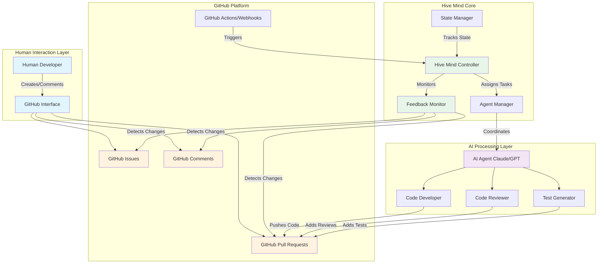
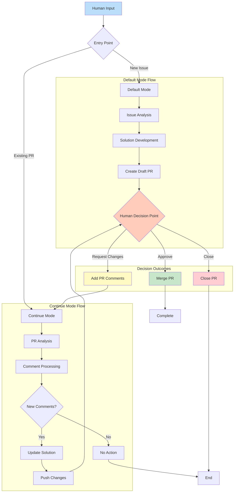
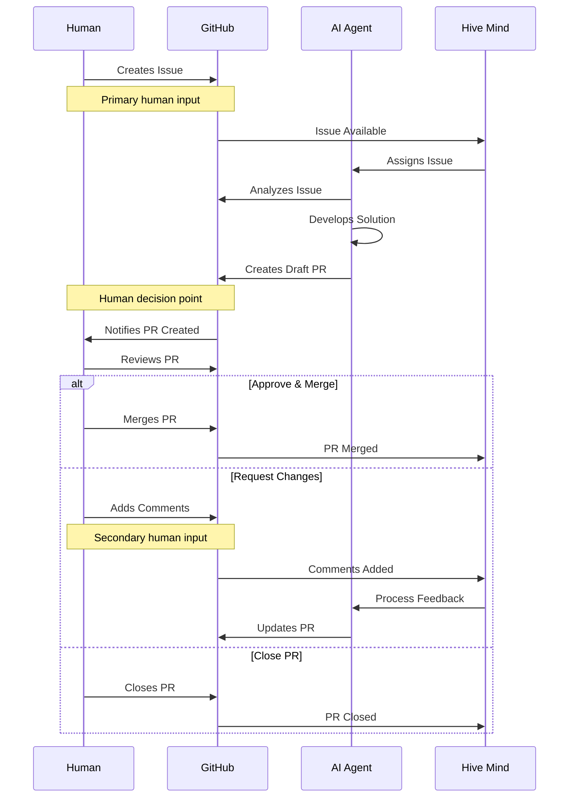
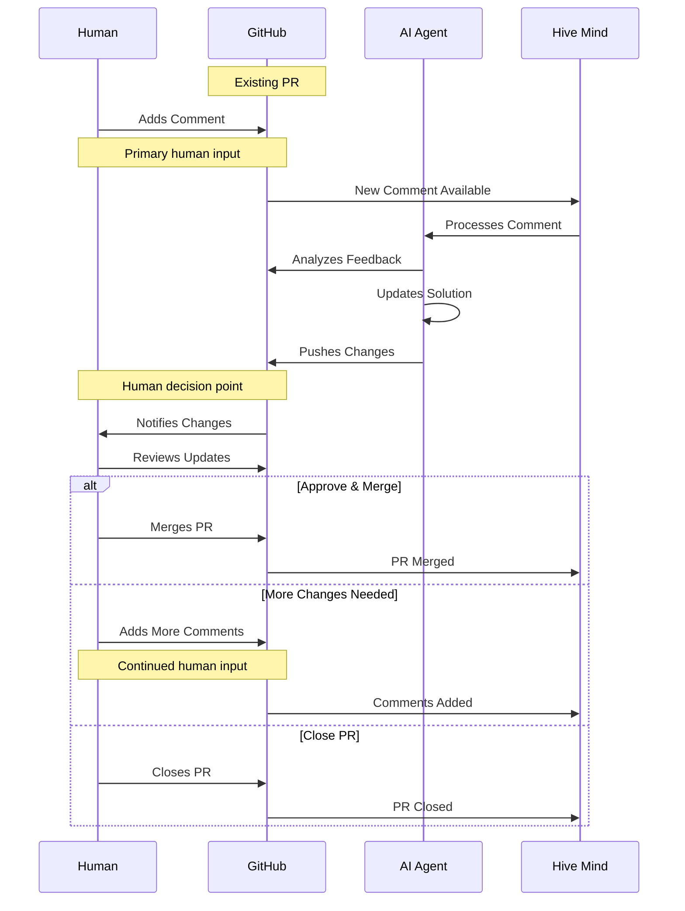
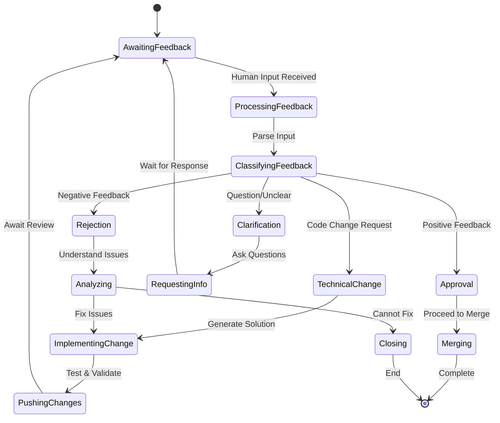
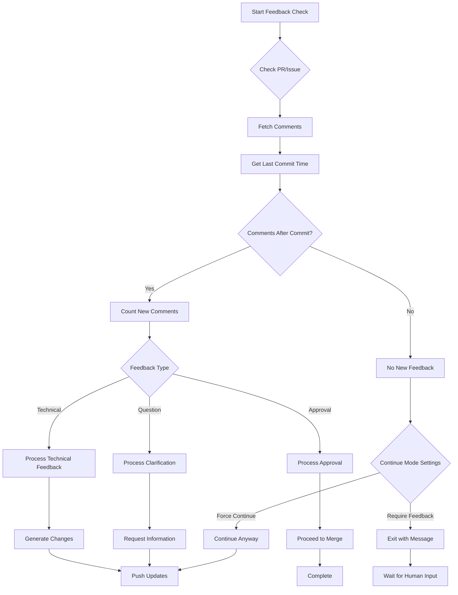

# Hive Mind Data Flow Documentation

This comprehensive document describes the data flow in Hive Mind, explicitly highlighting all points where human feedback is integrated into the system workflow.

## Table of Contents

1. [Overview](#overview)
2. [Operating Modes](#operating-modes)
3. [Data Flow Architecture](#data-flow-architecture)
4. [Mode 1: Default Mode](#mode-1-default-mode-issue--pull-request)
5. [Mode 2: Continue Mode](#mode-2-continue-mode-pull-request--comments)
6. [Human Feedback Integration Points](#human-feedback-integration-points)
7. [Configuration Options](#configuration-options)
8. [Error Handling & Fallbacks](#error-handling--fallbacks)
9. [Implementation Details](#implementation-details)
10. [Summary](#summary)

## Overview

Hive Mind is an AI-powered collaborative development system that operates through GitHub, maintaining human oversight at critical decision points while automating solution development. The system ensures human feedback remains central to the development process through multiple integration points.

## Operating Modes

Hive Mind operates in two primary modes based on the entry point and human interaction patterns:

| Mode | Entry Point | Primary Human Input | Secondary Input | Decision Points |
|------|------------|-------------------|-----------------|-----------------|
| **Default Mode** | GitHub Issue | Issue description & requirements | PR comments for refinements | Merge/Request Changes/Close |
| **Continue Mode** | Existing PR | PR comments with feedback | Additional PR comments | Merge/Request Changes/Close |

## Data Flow Architecture

### High-Level System Architecture



### Detailed Data Flow



## Mode 1: Default Mode (Issue → Pull Request)

### Human Feedback Points
- **Primary Input**: GitHub Issue description and requirements
- **Decision Point**: Merge, request changes, or close the PR
- **Secondary Input**: Comments on the PR for refinements

### Sequence Diagram



### Data Flow Steps
1. **Human creates GitHub issue** (Primary human input)
2. Hive Mind detects and assigns issue to AI agent
3. AI agent analyzes issue requirements
4. AI agent develops solution and creates draft PR
5. **Human reviews PR** (Human decision point)
6. **Human decides**: Merge, request changes, or close (Human feedback)
7. If changes requested, cycle continues with PR comments as input

## Mode 2: Continue Mode (Pull Request → Comments)

### Human Feedback Points
- **Primary Input**: Comments on existing PR
- **Decision Point**: Same as Mode 1 (merge, request changes, or close)
- **Trigger**: New comments or feedback detection

### Sequence Diagram



### Data Flow Steps
1. **Human adds comment to existing PR** (Primary human input)
2. Hive Mind detects new comment
3. AI agent processes comment and feedback
4. AI agent updates solution based on feedback
5. AI agent pushes changes to PR
6. **Human reviews updates** (Human decision point)
7. **Human decides**: Merge, add more comments, or close (Human feedback)
8. Cycle continues until resolution

## Human Feedback Integration Points

### Comprehensive Feedback Points Matrix

| Feedback Point | Mode | Timing | Input Type | System Response | Impact Level |
|---------------|------|---------|------------|-----------------|--------------|
| **Issue Creation** | Default | Initial | Requirements, Description | Triggers solution development | High - Defines entire scope |
| **Issue Comments** | Default | Ongoing | Clarifications, Updates | Updates requirements | Medium - Refines scope |
| **PR Creation Review** | Both | After draft | Initial assessment | Determines continuation | High - Go/No-go decision |
| **PR Comments** | Both | Iterative | Technical feedback | Triggers code updates | High - Directs changes |
| **Code Review** | Both | Per commit | Line-by-line feedback | Precise modifications | Medium - Specific fixes |
| **PR Approval** | Both | Final | Acceptance decision | Enables merge | Critical - Final gate |
| **PR Rejection** | Both | Any time | Stop signal | Halts process | Critical - Full stop |
| **Label Changes** | Both | Any time | Priority/status updates | Adjusts approach | Low - Process hints |

### 1. Issue Creation (Mode 1 Entry)
- **Type**: Requirements specification
- **Format**: GitHub issue description, labels, initial comments
- **Impact**: Defines scope and requirements for AI solution
- **Human Actions Available**:
  - Write detailed requirements
  - Attach examples or specifications
  - Set priority labels
  - Assign to specific agents
  - Link related issues

### 2. PR Review & Decision (Both Modes)
- **Type**: Approval/rejection decision
- **Format**: PR merge, close, or comment actions
- **Impact**: Determines if solution is acceptable or needs refinement
- **Human Actions Available**:
  - Approve and merge
  - Request changes with specific feedback
  - Close without merging
  - Convert to draft
  - Assign additional reviewers

### 3. PR Comments (Mode 2 Primary, Mode 1 Secondary)
- **Type**: Specific feedback and change requests
- **Format**: GitHub PR comments with technical details
- **Impact**: Guides AI agent refinements and iterations
- **Human Actions Available**:
  - Line-specific code comments
  - General PR conversation
  - Suggest specific changes
  - Request tests or documentation
  - Ask for clarification

### 4. Continuous Monitoring (Both Modes)
- **Type**: Ongoing oversight
- **Format**: PR status changes, additional comments
- **Impact**: Enables iterative improvement cycles
- **Human Actions Available**:
  - Monitor CI/CD results
  - Review automated test outcomes
  - Check code quality metrics
  - Validate against requirements
  - Provide ongoing guidance

### 5. Emergency Intervention Points
- **Type**: Critical feedback
- **Format**: Direct commands in comments
- **Impact**: Immediate system response
- **Triggers**:
  - `STOP` command in comment
  - PR closure
  - Branch protection activation
  - Manual revert

### Human Feedback Processing Flow



## Configuration Options

### Auto-Continue Behavior
- `--auto-continue`: Automatically continue with existing PRs for issues
- `--auto-continue-only-on-new-comments`: Only continue if new comments detected
- `--continue-only-on-feedback`: Only continue if feedback is present

### Human Interaction Controls
- `--auto-pull-request-creation`: Create draft PR before human review
- `--attach-logs`: Include detailed logs for human review
- Manual merge requirement ensures human oversight

## Error Handling & Fallbacks

### When Human Feedback is Absent
- System waits for input rather than proceeding
- Draft PRs remain in draft state until human action
- Auto-continue features respect feedback requirements

### When Human Feedback is Ambiguous
- AI requests clarification through PR comments
- Multiple solution proposals for human selection
- Conservative approach when uncertainty exists

## Implementation Details

### Command-Line Interface

The system provides various command-line options to control human feedback interaction:

```bash
# Default Mode - Issue to PR
./solve.mjs "https://github.com/owner/repo/issues/123"

# Continue Mode - PR with comments
./solve.mjs "https://github.com/owner/repo/pull/456"

# Auto-continue with feedback detection
./solve.mjs "https://github.com/owner/repo/issues/123" \
  --auto-continue \
  --auto-continue-only-on-new-comments

# Continue only when feedback is present
./solve.mjs "https://github.com/owner/repo/pull/456" \
  --continue-only-on-feedback
```

### Feedback Detection Algorithm



### State Management

The system maintains state across sessions to ensure continuity:

| State Element | Storage | Purpose | Persistence |
|--------------|---------|---------|-------------|
| Session ID | File System | Track conversation context | Until completion |
| PR Number | Memory/Args | Link issue to PR | Runtime |
| Comment History | GitHub API | Track new vs old feedback | Permanent |
| Commit History | Git | Determine feedback timing | Permanent |
| Configuration | CLI Args | Control behavior | Per execution |

## Summary

### Key Design Principles

1. **Human-Centric**: Every automated action is subject to human review and approval
2. **Feedback-Driven**: System responds dynamically to human input at multiple points
3. **Transparent**: All AI actions are visible through GitHub's standard interfaces
4. **Iterative**: Supports multiple rounds of refinement based on human feedback
5. **Configurable**: Behavior can be adjusted to match team workflows

### Data Flow Summary

The Hive Mind data flow architecture ensures comprehensive human oversight through:

- **Multiple Entry Points**: Issues (Default Mode) or PRs (Continue Mode)
- **Continuous Feedback Integration**: Comments processed in real-time
- **Clear Decision Gates**: Explicit human approval required for merging
- **Emergency Controls**: Immediate halt capabilities through commands
- **Flexible Configuration**: Adjustable automation levels

### Human Feedback Integration

| Mode | Primary Feedback | Secondary Feedback | Decision Authority |
|------|-----------------|-------------------|-------------------|
| **Default Mode** | Issue requirements | PR comments | Human merge decision |
| **Continue Mode** | PR comments | Additional comments | Human merge decision |

Both modes maintain human authority over critical decisions while leveraging AI for implementation, ensuring that human feedback remains the cornerstone of the development process.